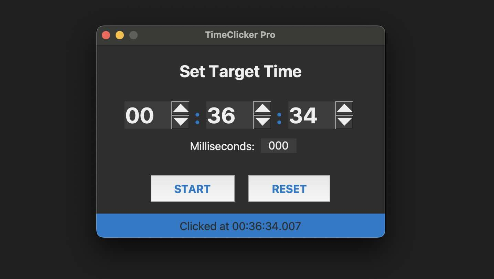
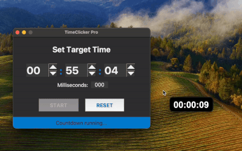

# TimeClicker Pro

A modern, cross-platform GUI application for scheduling precise mouse clicks. Built with Python and Tkinter, this tool allows users to set a target time down to the millisecond and have it trigger a click automatically.



---

## Features

- **Precise Timing:** Schedule a mouse click for a specific time (HH:MM:SS.mmm).
- **Modern UI:** A clean, dark-themed interface built for ease of use.
- **User-Friendly Controls:** Large, easy-to-use spinbox controls for setting the time.
- **Real-time Validation:** The "Start" button is automatically disabled if the selected time is in the past.
- **Mouse-Following Countdown:** An overlay window shows the countdown and follows your mouse cursor.

- **Global Abort Hotkey:** Press the `Esc` key at any time to instantly cancel the countdown.
- **Cross-Platform:** Can be run from source or built into a standalone application for both Windows and macOS.

## Specifications & Tech Stack

- **Python Version:** `3.12.x` (managed with `pyenv`)
- **Package Management:** `uv`
- **GUI:** Tkinter
- **Mouse Control:** `pyautogui`
- **Global Hotkeys:** `pynput`
- **Packaging:** `PyInstaller`

---

## Installation and Usage (from Source)

Follow these steps to run the application directly from the source code.

### 1. Prerequisites

- **pyenv:** For managing Python versions. ([Installation Guide](https://github.com/pyenv/pyenv#installation))
- **uv:** For package management. ([Installation Guide](https://astral.sh/uv/install.sh))
- **Git**

### 2. Set Up Python Version

Clone the repository and set the correct local Python version using `pyenv`.

```bash
git clone <your-repository-url>
cd timeclicker

# Install the target Python version if you don't have it
pyenv install 3.12.12

# Set the version for this project folder
pyenv local 3.12.12
```

### 3. Set Up Virtual Environment & Dependencies

This project uses `uv` for fast environment and package management.

**On macOS/Linux:**
```bash
# Create and activate a virtual environment
python -m venv .venv
source .venv/bin/activate

# Install dependencies with uv
uv pip install -r requirements.txt
```

**On Windows:**
```cmd
# Create and activate a virtual environment
python -m venv .venv
.venv\Scripts\activate

# Install dependencies with uv
uv pip install -r requirements.txt
```

### 4. Run the Application

```bash
python timeclicker.py
```

---

## Building a Standalone Application

You can package TimeClicker Pro into a single, standalone executable file for easy distribution.

### 1. Prerequisites

- All dependencies from the previous steps are installed.
- `PyInstaller` is installed (`uv pip install pyinstaller`).

### 2. Prepare Icon Files

Place your desired icon files in the root of the project directory:
- For Windows, name it `icon.ico`.
- For macOS, name it `icon.icns`.

### 3. Build for macOS

Run the following command in your terminal:

```bash
pyinstaller --onefile --windowed --icon="icon.icns" --name="TimeClicker" timeclicker.py
```

After the build completes, you will find **TimeClicker.app** inside the `dist` folder.

#### Important: macOS Accessibility Permissions

The first time you run the `.app`, the click function will not work due to security restrictions. You must grant accessibility permissions:
1. Open **System Settings** > **Privacy & Security** > **Accessibility**.
2. Click the **+** button.
3. Navigate to the `dist` folder and add **TimeClicker.app**.
4. Ensure the toggle next to it is enabled.
5. Relaunch the application.

### 4. Build for Windows

The build process must be run on a Windows machine. Run the following command in Command Prompt or PowerShell:

```cmd
pyinstaller --onefile --windowed --icon="icon.ico" --name="TimeClicker" timeclicker.py
```

After the build completes, you will find **TimeClicker.exe** inside the `dist` folder.

---

## License

This project is licensed under the MIT License.
